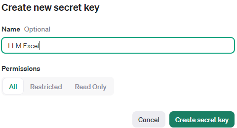
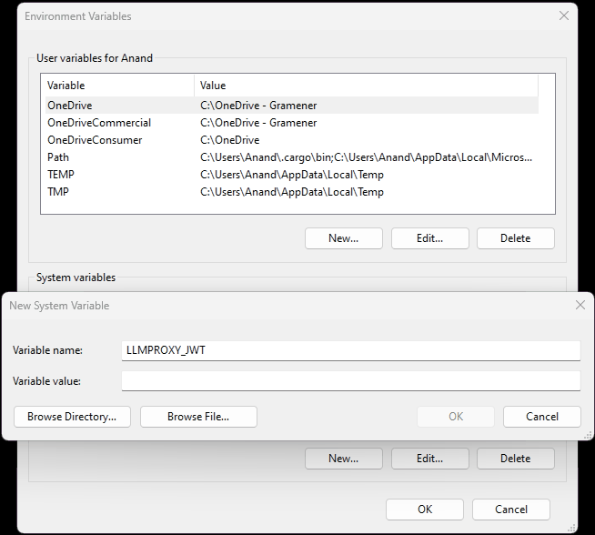
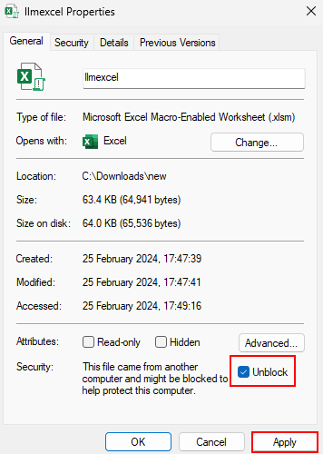

# llmexcel

[Download llmexcel.xlsm](llmexcel.xlsm ":ignore").

This is an Excel file (with a Visual Basic macro function) that adds an `=LLM()` function that talks to large language models like ChatGPT.

This can be used for:

- **Audit**. E.g. `=LLM("Is this a polite response? Say YES/NO with reason: " & A1)`
- **Classification**. E.g. `=LLM("Is this a positive or negative review: " & A1)`
- **Extraction**. E.g. `=LLM("Return the name, date and amount from this complaint: " & A1)`
- **Reformatting**. E.g. `=LLM("Convert this citation to the APA format: " & A1)`
- **Summarization**. E.g. `=LLM("Summarize this article: " & A1)`
- **Translation**. E.g. `=LLM("Translate to French: " & A1)`
- **Validation**. E.g. `=LLM("Is this a valid email address: " & A1)`

## Requirements

- **Windows only, not Mac**. The `MSXML2` reference we use to access the APIs is not available on Mac.
- **Excel 365, not older**. It may work on older versions (e.g. Excel 2017) but hasn't been tested.

## Get your API key

If you're a Gramener, LearningMate or Straive employee, copy your LLM Foundry Token from <https://llmfoundry.straive.com/code>.

If not, sign up at <https://platform.openai.com/account/api-keys>. Click on "Create new key" and copy the API key.

## Set up environment variable

In the start menu, search for "Environment Variables" and click on "Edit environment variables for your account".

Click on the "New" button to add a new environment variable for your account.

Set the **Variable name** to:

- `LLMFOUNDRY_TOKEN` if you got your key from <https://llmfoundry.straive.com/code>
- `OPENAI_API_KEY` if you got your key from <https://platform.openai.com/account/api-keys>

Paste the **Variable value** as your [API key](#get-your-api-key).

Click OK to close the Environment Variables dialog. Then click OK to close the System Properties dialog.

## Open llmexcel.xlsm

[Download llmexcel.xlsm](llmexcel.xlsm ":ignore").

If you open the file, you'll see this "Security Risk" error.

Right-click on the file and select "Properties". Then click on "Unblock" and "Apply".

When you open the file, you may see a "Protected View" message. Click on "Enable editing".

If you see a security warning, click on "Enable Content".

## Use `=LLM()` function

In any cell, type `=LLM("Translate OK to French")` and press Enter. It will return the answer.

**Refresh manually with <kbd>F9</kbd>**. If you change the question, you need to press <kbd>F9</kbd> to refresh the answer.

**Drag across cells**. If you have questions in A1:A10, type `=LLM(A1)` in B1 and drag it down to B10. Then press <kbd>F9</kbd> to refresh.

## Parameters

- **Prompt**: The question or text to generate a response for
- **Model** (default: `gpt-4o-mini`). You can use any [models](https://platform.openai.com/docs/models/) newer than `gpt-3.5-turbo-1106`, e.g. `gpt-4o`
- **Refresh** (default: `FALSE`): By default, responses are cached. Use `=LLM(A1,,TRUE)` for a new response.
- **Temperature** (default: `1`): For precise responses, reduce temperature, e.g. `=LLM(A1,,,0.2)`. Can be between 0 and 2.

## Examples

If `A1` contains "Translate OK to French":

- `=LLM(A1)` - translate "OK" to French
- `=LLM(A1, "gpt-4o")` - use GPT-4o instead of GPT-4o-mini
- `=LLM(A1,,TRUE)` - get a new response
- `=LLM(A1,,TRUE,2)` - get a new response with more variation

## How it works

[See the source](https://code.gramener.com/cto/llmexcel/-/blob/main/llmexcel.bas ":ignore").

When the `LLM()` function is called, it:

1. Creates an OpenAI API request using the prompt, telling OpenAI to "Return only 1 JSON array".
2. Passes it to [LLM Foundry](https://llmfoundry.straive.com/), which passes it to OpenAI (unless cached).
3. Parse the response as JSON. If there are multiple values, return an array of values.
4. If there's an error anywhere, return the error message instead

## Troubleshooting

- If you get a "Macros have been disabled" security message, click "Enable Content".
- Tools - References - Enable "Microsoft Scripting Runtime"

**Raise your issue** at <https://code.gramener.com/cto/llmexcel/-/issues>.
